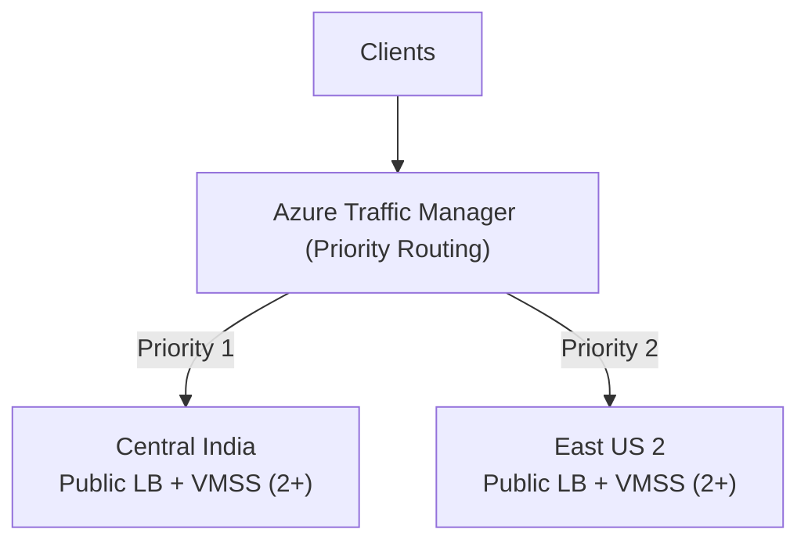

# Azure Multi-Region High Availability Infrastructure (Terraform)

This Terraform project deploys a **high-availability Azure setup across two regions**:
- **Primary region:** `Central India`
- **Failover region:** `East US 2`

It creates a complete active/passive topology:
1. Independent infrastructure in each region (resource group, VNet, subnet, NSG).
2. A regional Standard Load Balancer with a Linux VM Scale Set behind it.
3. Global DNS failover through Azure Traffic Manager using **Priority routing**.

Traffic Manager sends traffic to India by default and automatically fails over to US when the India endpoint is unhealthy.

## Architecture


### Architecture Diagram (Mermaid)



## Failover Flow (Visual)


## Files

- `versions.tf` - Terraform and provider versions.
- `variables.tf` - Input variables with defaults and validation.
- `main.tf` - Core infrastructure resources with inline comments.
- `outputs.tf` - Useful output values (global FQDN, regional endpoints).
- `terraform.tfvars.example` - Example variable file.
- `scripts/cloud-init.sh` - Bootstraps Nginx and prints region identity.
- `docs/images/architecture-overview.svg` - High-level architecture visual.
- `docs/images/failover-flow.svg` - Step-by-step failover visual.

## Prerequisites

- Terraform `>= 1.5`
- Azure CLI
- Azure subscription with permissions to create networking/compute resources
- SSH public key for Linux VM access

## Quick Start

1. Authenticate to Azure:

```bash
az login
az account set --subscription "<YOUR_SUBSCRIPTION_ID_OR_NAME>"
```

2. Create your variable file:

```bash
cp terraform.tfvars.example terraform.tfvars
```

3. Update `terraform.tfvars` with your SSH public key and optional naming/tags.

4. Deploy:

```bash
terraform init
terraform plan
terraform apply
```

5. Get the global endpoint:

```bash
terraform output traffic_manager_fqdn
```

Open `http://<traffic_manager_fqdn>` in a browser. The page should show the active serving region.

## How Failover Works

- Traffic Manager probes each regional endpoint over HTTP `/` on port `80`.
- Endpoint priorities are fixed:
  - `1` = India (active)
  - `2` = US (standby)
- If the India endpoint fails health checks, Traffic Manager directs users to US automatically.

## Validation and Testing

- Check regional endpoint DNS names:

```bash
terraform output regional_public_fqdns
```

- Simulate regional failure (example):
  - Stop or scale down primary VMSS to unhealthy state.
  - Wait for Traffic Manager health probe cycle.
  - Refresh the global URL and verify US region appears in the page content.

## Cost Optimization Strategy

Use the following controls to reduce spend while preserving high availability goals:

1. Right-size regional compute
- Start with a smaller VM size (for example `Standard_B1ms`/`B2s`) and increase only after load testing.
- Keep `vm_instances_per_region` at the minimum that still meets SLA and performance targets.

2. Use active/passive economics intentionally
- Keep India as fully active.
- Keep US failover sized for standby baseline, then scale up during incident response (or via autoscale policy).

3. Add autoscale policies for VMSS
- Scale on CPU/request metrics instead of fixed high instance counts.
- Use aggressive scale-in cooldown for non-peak periods.

4. Optimize Azure purchase model
- Use Reserved Instances or Savings Plans for always-on baseline capacity.
- Keep burst/uncertain capacity on pay-as-you-go.

5. Reduce data transfer and egress
- Serve region-local users from India when possible.
- Keep cross-region replication and inter-region data movement to essential workloads only.

6. Tune observability and retention
- Collect only required diagnostics/metrics at high frequency.
- Set Log Analytics retention to compliance minimums instead of long defaults.

7. Separate environments with lower non-prod footprint
- Use smaller SKUs and fewer instances for dev/test.
- Schedule non-production shutdown windows where possible.

8. Governance and budget guardrails
- Apply Azure Budgets with cost alerts at 50/75/90/100% thresholds.
- Enforce tagging (`environment`, `owner`, `cost_center`) for chargeback and cleanup.

### Recommended Immediate Tweaks for This Repo

- Keep `vm_instances_per_region = 2` only if required by your SLA; otherwise evaluate `1` in secondary for standby.
- Reassess `vm_sku = "Standard_B2s"` after benchmark; downsize if sustained utilization is low.
- Add VMSS autoscale rules before production traffic ramp-up.

## Clean Up

```bash
terraform destroy
```

## Notes

- This is an infrastructure baseline template; harden for production (private ingress, WAF, secrets management, backup, monitoring, policy).
- Running two VMSS + load balancers in two regions incurs ongoing Azure costs.
