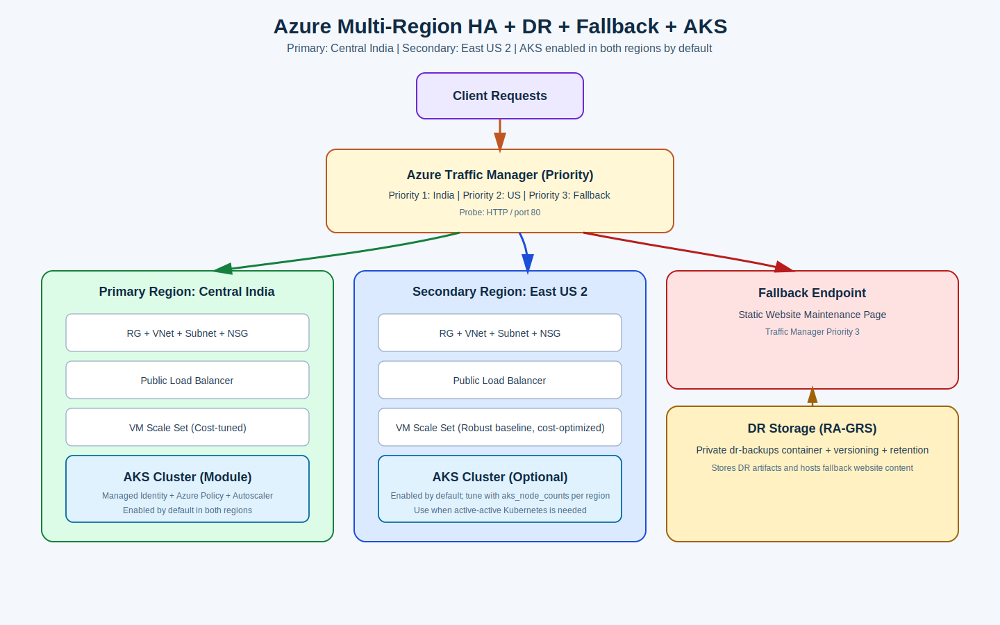
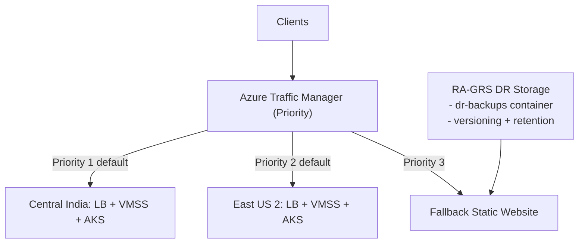
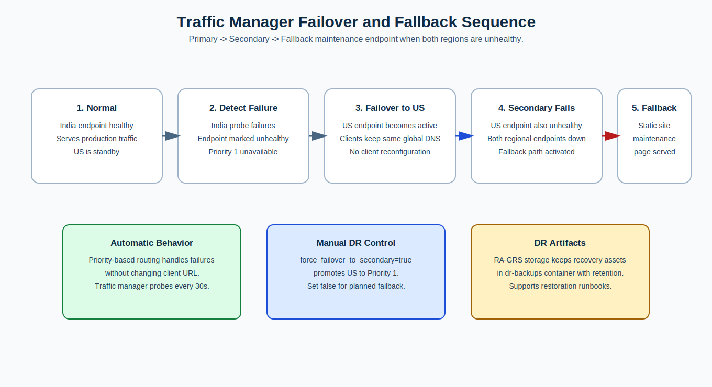
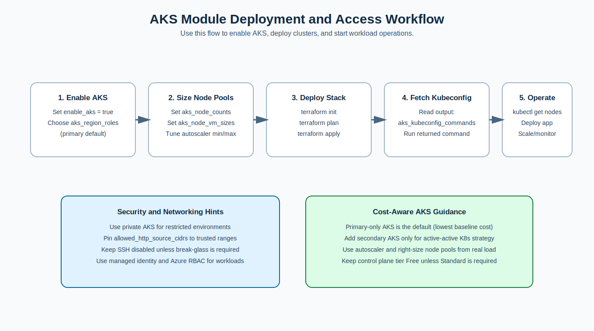

# Azure Multi-Region High Availability + DR Infrastructure (Terraform)

This Terraform project deploys a resilient Azure architecture with:
- **Primary region:** `Central India`
- **Secondary region:** `East US 2`
- **Global routing:** Azure Traffic Manager (Priority mode)
- **Disaster recovery storage:** RA-GRS Storage Account for DR artifacts
- **Last-resort fallback:** Static maintenance website endpoint
- **Kubernetes platform:** AKS module (primary and secondary enabled by default)

## What Is Implemented

1. Regional robust compute platform
- Separate RG, VNet, subnet, NSG, LB, and Linux VMSS in both regions.
- Traffic Manager prioritizes India first and US second.

2. Disaster recovery mechanism
- Geo-redundant (`RA-GRS`) storage account for DR artifacts and recovery payloads.
- Private `dr-backups` container for backup exports/runbook payloads.
- Blob versioning + retention lifecycle policy (`dr_data_retention_days`).

3. Fallback mechanism
- Static website endpoint hosted in DR storage.
- Added as **Priority 3** Traffic Manager endpoint.
- If both regional endpoints are unhealthy, users receive maintenance page instead of hard downtime.

4. Controlled failover/failback switch
- `force_failover_to_secondary = true` makes US region active.
- Set back to `false` to restore India as active.

5. Cost-optimized robust default compute profile
- Primary runs `2 x Standard_B2s` (regular priority).
- Secondary runs `2 x Standard_B2s` (regular priority).
- Secondary Spot remains available but disabled by default for resilience-first operations.

6. Security-first baseline controls
- SSH access is disabled by default (`enable_ssh_access = false`).
- NSG ingress rules are CIDR-allowlist based for HTTP and SSH.
- VM Scale Sets enforce SSH key auth and use System Assigned Managed Identity.
- DR storage uses TLS 1.2+, private backup container, and lifecycle retention.

7. Kubernetes module support
- AKS clusters are deployed through a dedicated module (`modules/aks_kubernetes`).
- Default configuration deploys AKS in both regions with autoscaling.
- Cluster sizing is kept cost-aware via node VM sizing and autoscaler limits.

## Architecture



### Architecture Diagram (Mermaid)



## Failover and Fallback Flow



## Files

- `versions.tf` - Terraform and provider versions.
- `variables.tf` - Input variables and DR/fallback toggles.
- `main.tf` - Root orchestration that imports all Azure service modules.
- `outputs.tf` - Aggregated endpoint, DR, and VMSS outputs.
- `terraform.tfvars.example` - Sample variable file.
- `scripts/cloud-init.sh` - Bootstraps Nginx for health endpoint.
- `k8s-examples/persistent-volume-nginx.yaml` - AKS workload example with persistent volume claim.
- `docs/images/architecture-overview.svg` - Architecture visual.
- `docs/images/failover-flow.svg` - Failover/fallback flow visual.
- `docs/images/aks-operations-flow.svg` - AKS deployment and access workflow visual.
- `examples/*.tfvars` - Ready-to-use deployment profiles for common scenarios.

## Module Layout

- `modules/regional_foundation` - Resource Group, VNet, Subnet, NSG, and subnet association.
- `modules/regional_load_balancer` - Public IP, Load Balancer, backend pool, probe, and rule.
- `modules/regional_compute` - Linux VM Scale Set attached to regional backend pool.
- `modules/aks_kubernetes` - AKS cluster per selected region with secure defaults.
- `modules/dr_storage_fallback` - RA-GRS storage, DR backup container, lifecycle policy, fallback static pages.
- `modules/global_traffic_manager` - Traffic Manager profile, regional endpoints, fallback endpoint.

## Key Variables

- `force_failover_to_secondary` (bool): manual promotion of US endpoint.
- `enable_fallback_website` (bool): enables/disables fallback endpoint.
- `dr_data_retention_days` (number): retention for DR backup artifacts.
- `primary_vm_instances` / `secondary_vm_instances`: region-specific sizing.
- `primary_vm_sku` / `secondary_vm_sku`: region-specific VM SKUs.
- `enable_secondary_spot` / `secondary_spot_max_bid_price`: optional Spot savings controls for overflow/non-critical capacity.
- `allowed_http_source_cidrs`: explicit HTTP source CIDR allowlist.
- `enable_ssh_access` / `allowed_ssh_source_cidrs`: break-glass SSH controls.
- `enable_aks` / `aks_region_roles`: AKS enablement and region selection.
- `aks_node_counts` / `aks_node_vm_sizes`: AKS sizing controls.
- `aks_enable_cluster_autoscaler`, `aks_node_min_counts`, `aks_node_max_counts`: AKS scaling controls.
- `aks_private_cluster_enabled`, `aks_sku_tier`: AKS security/cost posture controls.

## Security Principles

1. Least privilege by default
- Keep SSH disabled unless an incident requires break-glass access.
- Restrict HTTP and SSH to known CIDR ranges whenever possible.

2. Identity over secrets
- Use System Assigned Managed Identity on VMSS workloads.
- Prefer Azure RBAC and managed identities over static credentials in code.

3. Defense in depth
- Use regional isolation, NSGs, load balancer probes, and Traffic Manager failover.
- Keep fallback endpoint limited to maintenance experience, not privileged functions.

4. Data protection and retention discipline
- Store DR artifacts in private blob container with versioning and retention controls.
- Tune retention (`dr_data_retention_days`) to compliance minimum needed.

5. Controlled emergency access
- Enable SSH temporarily for approved source CIDRs only.
- Revert `enable_ssh_access = false` after maintenance.

## Prerequisites

- Terraform `>= 1.5`
- Azure CLI
- `kubectl` (for cluster operations)
- Azure subscription with permissions for network/compute/storage
- Azure permissions to create AKS clusters and node pools
- SSH public key for VMSS Linux login

## Quick Start

1. Authenticate:

```bash
az login
az account set --subscription "<YOUR_SUBSCRIPTION_ID_OR_NAME>"
```

2. Prepare variables:

```bash
cp terraform.tfvars.example terraform.tfvars
```

3. Set required values in `terraform.tfvars` (especially `ssh_public_key`).

4. Deploy:

```bash
terraform init
terraform plan
terraform apply
```

5. Get endpoints:

```bash
terraform output traffic_manager_fqdn
terraform output traffic_manager_endpoint_priorities
terraform output fallback_website_url
terraform output aks_cluster_names
terraform output aks_kubeconfig_commands
```

## Usage Examples

Use these prebuilt profiles from the `examples/` directory:

1. Balanced robust baseline in both regions:

```bash
terraform plan -var-file="examples/01-balanced-robust-active-active.tfvars"
terraform apply -var-file="examples/01-balanced-robust-active-active.tfvars"
```

2. Security-hardened profile with restricted ingress and private AKS:

```bash
terraform plan -var-file="examples/02-secure-private-aks.tfvars"
terraform apply -var-file="examples/02-secure-private-aks.tfvars"
```

3. DR failover drill profile (forces secondary active):

```bash
terraform plan -var-file="examples/03-dr-failover-drill.tfvars"
terraform apply -var-file="examples/03-dr-failover-drill.tfvars"
terraform output traffic_manager_endpoint_priorities
```

4. Active-active AKS in both regions:

```bash
terraform plan -var-file="examples/04-active-active-aks.tfvars"
terraform apply -var-file="examples/04-active-active-aks.tfvars"
terraform output aks_cluster_names
```

Note: each example file contains `ssh_public_key = "REPLACE_WITH_YOUR_SSH_PUBLIC_KEY"`. Replace that value before apply.

## Kubernetes (AKS) Instructions



### A) Deploy AKS in both primary and secondary (default)

1. Keep `enable_aks = true`.
2. Keep `aks_region_roles = ["primary", "secondary"]`.
3. Run `terraform apply`.
4. Run command from `terraform output aks_kubeconfig_commands`.
5. Verify cluster access:

```bash
kubectl get nodes
```

### B) Tune AKS scale profile for your workload

1. Keep `aks_region_roles = ["primary", "secondary"]`.
2. Tune `aks_node_counts`, `aks_node_min_counts`, and `aks_node_max_counts` per region.
3. Run `terraform apply`.
4. Fetch kubeconfig for each region from `aks_kubeconfig_commands` output.

### C) Deploy a Kubernetes workload using volume (PVC)

```bash
kubectl apply -f k8s-examples/persistent-volume-nginx.yaml
kubectl get pvc -n apps-demo
kubectl get pods -n apps-demo -o wide
kubectl get svc -n apps-demo nginx-volume-demo
```

Note: this example uses `storageClassName: managed-csi` (default on AKS). If your cluster uses a different storage class, update the manifest.

### D) Validate persistence after pod restart

```bash
kubectl exec -n apps-demo deploy/nginx-volume-demo -- sh -c 'echo "hello-from-pvc" >> /usr/share/nginx/html/index.html'
kubectl delete pod -n apps-demo -l app=nginx-volume-demo
kubectl wait --for=condition=ready pod -n apps-demo -l app=nginx-volume-demo --timeout=180s
kubectl exec -n apps-demo deploy/nginx-volume-demo -- cat /usr/share/nginx/html/index.html
```

If `hello-from-pvc` is still present after restart, volume persistence is working as expected.

### E) Recommended AKS baseline settings

```hcl
enable_aks                    = true
aks_region_roles              = ["primary", "secondary"]
aks_sku_tier                  = "Free"
aks_private_cluster_enabled   = false
aks_enable_cluster_autoscaler = true
aks_node_counts               = { primary = 2, secondary = 2 }
aks_node_min_counts           = { primary = 2, secondary = 2 }
aks_node_max_counts           = { primary = 4, secondary = 4 }
```

## Proper DR and Fallback Operation Steps

### A) Standard production mode

1. Ensure `force_failover_to_secondary = false`.
2. Run `terraform apply`.
3. Confirm priorities output: `primary=1`, `secondary=2`, `fallback=3`.

### B) Manual disaster failover to US

1. Set `force_failover_to_secondary = true` in `terraform.tfvars`.
2. Run `terraform apply`.
3. Verify priorities output now shows `secondary=1` and `primary=2`.
4. Validate app response through `traffic_manager_fqdn`.

### C) Failback to India after recovery

1. Set `force_failover_to_secondary = false`.
2. Run `terraform apply`.
3. Verify priorities output returns to `primary=1`.

### D) DR artifact handling process

1. Use output `dr_storage_account_name` and container `dr-backups`.
2. Upload backup exports/artifacts regularly (DB dumps, app exports, config bundles).
3. Keep retention aligned with `dr_data_retention_days` and compliance needs.

### E) Last-resort fallback validation drill

1. Keep `enable_fallback_website = true`.
2. Simulate both regions unhealthy (for example, scale both VMSS sets to zero during a controlled test).
3. Wait for Traffic Manager probe cycles.
4. Access global URL and confirm maintenance page is served from fallback endpoint.

## Cost Optimization Strategy

1. Right-size compute
- Primary and secondary are intentionally kept at robust but right-sized baseline capacity.
- Keep both regions at minimum viable resilient size, then scale out via autoscaler.

2. Use autoscale
- Add VMSS autoscale rules for peak and off-peak usage.

3. Optimize purchase model
- Reserved capacity/Savings Plans for both regional baselines.
- Use Spot selectively for non-critical overflow capacity only.

4. Minimize unnecessary retention and egress
- Keep only required logs and backup retention.
- Reduce non-essential inter-region traffic.

### Cost-First Recommended Settings

```hcl
primary_vm_instances         = 2
secondary_vm_instances       = 2
primary_vm_sku               = "Standard_B2s"
secondary_vm_sku             = "Standard_B2s"
enable_secondary_spot        = false
secondary_spot_max_bid_price = -1
```

### Security-First Recommended Settings

```hcl
allowed_http_source_cidrs = ["203.0.113.0/24"] # replace with your trusted ingress range(s)
enable_ssh_access         = false
allowed_ssh_source_cidrs  = []
```

## Cleanup

```bash
terraform destroy
```

## Notes

- This baseline is intentionally simple; production hardening should include WAF, private ingress, secret rotation, and policy enforcement.
- Multi-region infrastructure has continuous cost implications even with optimized dual-region baselines.
