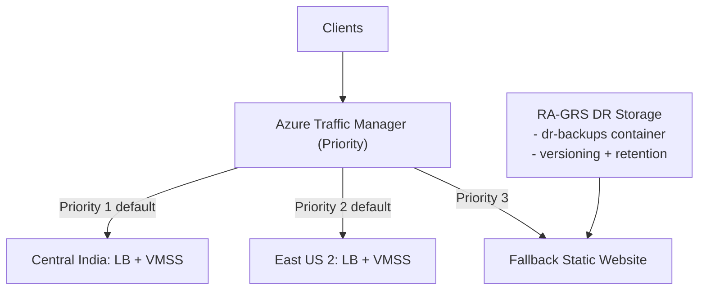

# Azure Multi-Region High Availability + DR Infrastructure (Terraform)

This Terraform project deploys a resilient Azure architecture with:
- **Primary region:** `Central India`
- **Secondary region:** `East US 2`
- **Global routing:** Azure Traffic Manager (Priority mode)
- **Disaster recovery storage:** RA-GRS Storage Account for DR artifacts
- **Last-resort fallback:** Static maintenance website endpoint

## What Is Implemented

1. Regional active/passive compute platform
- Separate RG, VNet, subnet, NSG, LB, and Linux VMSS in both regions.
- Traffic Manager prioritizes India first and US second.

2. Disaster recovery mechanism
- Geo-redundant (`RA-GRS`) storage account for DR artifacts and recovery payloads.
- Private `dr-backups` container for backup exports/runbook payloads.
- Blob versioning + retention lifecycle policy (`dr_data_retention_days`).

3. Fallback mechanism
- Static website endpoint hosted in DR storage.
- Added as **Priority 3** Traffic Manager endpoint.
- If both regional endpoints are unhealthy, users receive maintenance page instead of hard downtime.

4. Controlled failover/failback switch
- `force_failover_to_secondary = true` makes US region active.
- Set back to `false` to restore India as active.

5. Cost-efficient default compute profile
- Primary runs `2 x Standard_B2s` (regular priority).
- Secondary runs `1 x Standard_B1ms` by default.
- Secondary supports Spot mode (`enable_secondary_spot = true`) to lower standby cost further.

## Architecture


### Architecture Diagram (Mermaid)



## Failover and Fallback Flow


## Files

- `versions.tf` - Terraform and provider versions.
- `variables.tf` - Input variables and DR/fallback toggles.
- `main.tf` - Root orchestration that imports all Azure service modules.
- `outputs.tf` - Aggregated endpoint, DR, and VMSS outputs.
- `terraform.tfvars.example` - Sample variable file.
- `scripts/cloud-init.sh` - Bootstraps Nginx for health endpoint.
- `docs/images/architecture-overview.svg` - Architecture visual.
- `docs/images/failover-flow.svg` - Failover/fallback flow visual.

## Module Layout

- `modules/regional_foundation` - Resource Group, VNet, Subnet, NSG, and subnet association.
- `modules/regional_load_balancer` - Public IP, Load Balancer, backend pool, probe, and rule.
- `modules/regional_compute` - Linux VM Scale Set attached to regional backend pool.
- `modules/dr_storage_fallback` - RA-GRS storage, DR backup container, lifecycle policy, fallback static pages.
- `modules/global_traffic_manager` - Traffic Manager profile, regional endpoints, fallback endpoint.

## Key Variables

- `force_failover_to_secondary` (bool): manual promotion of US endpoint.
- `enable_fallback_website` (bool): enables/disables fallback endpoint.
- `dr_data_retention_days` (number): retention for DR backup artifacts.
- `primary_vm_instances` / `secondary_vm_instances`: region-specific sizing.
- `primary_vm_sku` / `secondary_vm_sku`: region-specific VM SKUs.
- `enable_secondary_spot` / `secondary_spot_max_bid_price`: standby Spot optimization controls.

## Prerequisites

- Terraform `>= 1.5`
- Azure CLI
- Azure subscription with permissions for network/compute/storage
- SSH public key for VMSS Linux login

## Quick Start

1. Authenticate:

```bash
az login
az account set --subscription "<YOUR_SUBSCRIPTION_ID_OR_NAME>"
```

2. Prepare variables:

```bash
cp terraform.tfvars.example terraform.tfvars
```

3. Set required values in `terraform.tfvars` (especially `ssh_public_key`).

4. Deploy:

```bash
terraform init
terraform plan
terraform apply
```

5. Get endpoints:

```bash
terraform output traffic_manager_fqdn
terraform output traffic_manager_endpoint_priorities
terraform output fallback_website_url
```

## Proper DR and Fallback Operation Steps

### A) Standard production mode

1. Ensure `force_failover_to_secondary = false`.
2. Run `terraform apply`.
3. Confirm priorities output: `primary=1`, `secondary=2`, `fallback=3`.

### B) Manual disaster failover to US

1. Set `force_failover_to_secondary = true` in `terraform.tfvars`.
2. Run `terraform apply`.
3. Verify priorities output now shows `secondary=1` and `primary=2`.
4. Validate app response through `traffic_manager_fqdn`.

### C) Failback to India after recovery

1. Set `force_failover_to_secondary = false`.
2. Run `terraform apply`.
3. Verify priorities output returns to `primary=1`.

### D) DR artifact handling process

1. Use output `dr_storage_account_name` and container `dr-backups`.
2. Upload backup exports/artifacts regularly (DB dumps, app exports, config bundles).
3. Keep retention aligned with `dr_data_retention_days` and compliance needs.

### E) Last-resort fallback validation drill

1. Keep `enable_fallback_website = true`.
2. Simulate both regions unhealthy (for example, scale both VMSS sets to zero during a controlled test).
3. Wait for Traffic Manager probe cycles.
4. Access global URL and confirm maintenance page is served from fallback endpoint.

## Cost Optimization Strategy

1. Right-size compute
- Primary and secondary are intentionally different sizes in defaults.
- Keep secondary at low standby capacity unless incident traffic requires more.

2. Use autoscale
- Add VMSS autoscale rules for peak and off-peak usage.

3. Optimize purchase model
- Reserved capacity/Savings Plans for primary baseline, Spot for secondary standby.

4. Minimize unnecessary retention and egress
- Keep only required logs and backup retention.
- Reduce non-essential inter-region traffic.

### Cost-First Recommended Settings

```hcl
primary_vm_instances         = 2
secondary_vm_instances       = 1
primary_vm_sku               = "Standard_B2s"
secondary_vm_sku             = "Standard_B1ms"
enable_secondary_spot        = true
secondary_spot_max_bid_price = -1
```

## Cleanup

```bash
terraform destroy
```

## Notes

- This baseline is intentionally simple; production hardening should include WAF, private ingress, secret rotation, and policy enforcement.
- Multi-region infrastructure has continuous cost implications even in standby mode.
